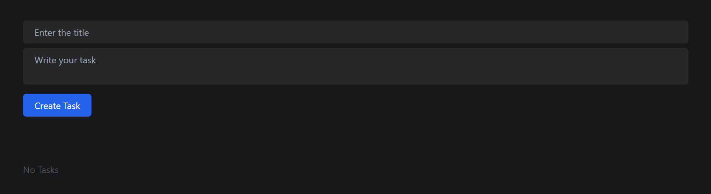
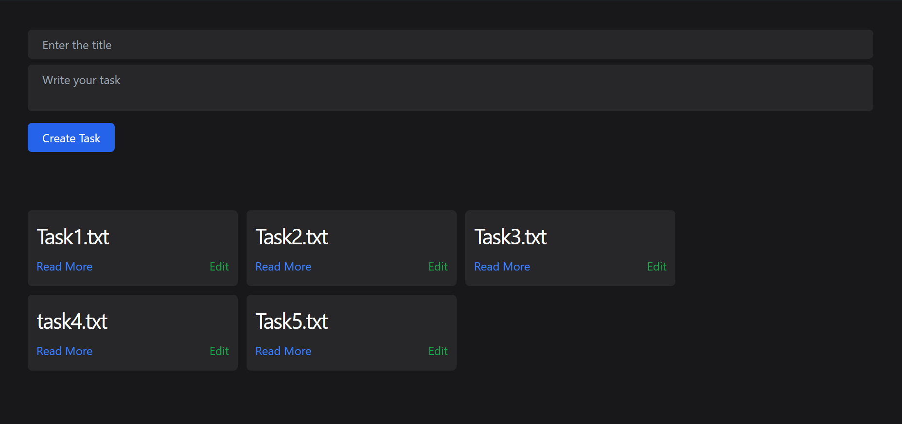
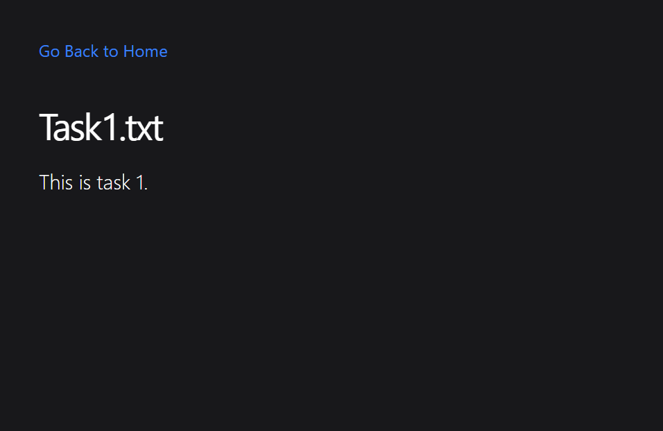
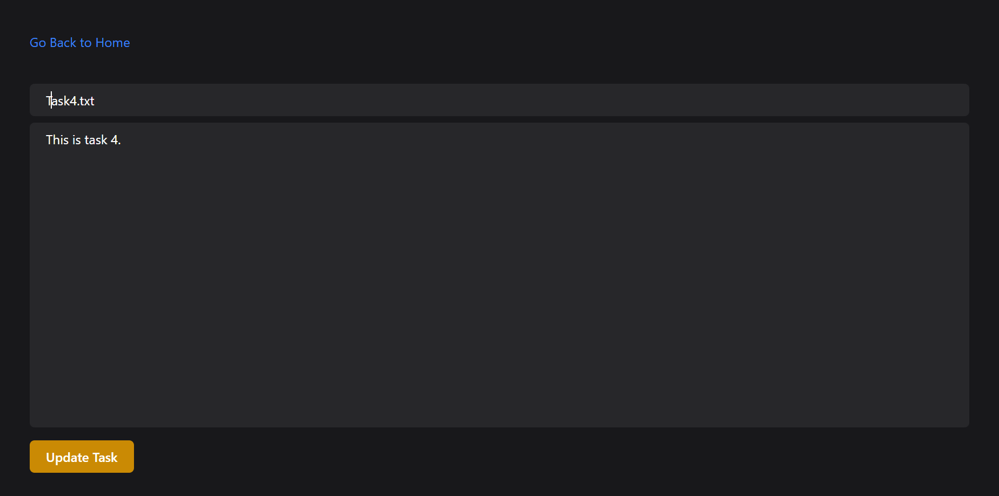

# Note Pad



A simple web-based note-taking app built with Node.js, Express, EJS, and TailwindCSS. This app allows users to create, read, edit, and manage text files as notes.

## Features

- Create tasks and notes
- View notes
- Edit tasks and notes
- Simple and clean user interface

## Screenshots

### Index Page


### Show File Page


### Edit File Page


## Tech Stack

- **Backend**: Node.js, Express.js
- **Frontend**: EJS, TailwindCSS
- **Storage**: File System (using `fs` module)

## How to Run the Project

1. Clone the repository:
    ```bash
    git clone https://github.com/adithya-b-r/NotePad.git
    cd notepad
    ```

2. Install dependencies:
    ```bash
    npm install
    ```

3. Start the server:
    ```bash
    npm start
    ```

4. Open the app in your browser:
    - Visit `http://localhost:3000`
